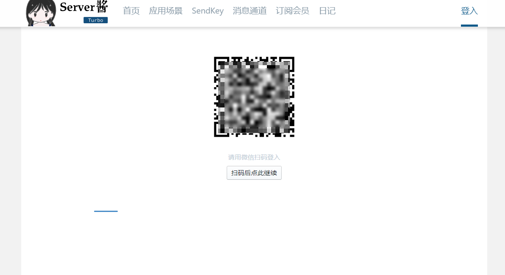
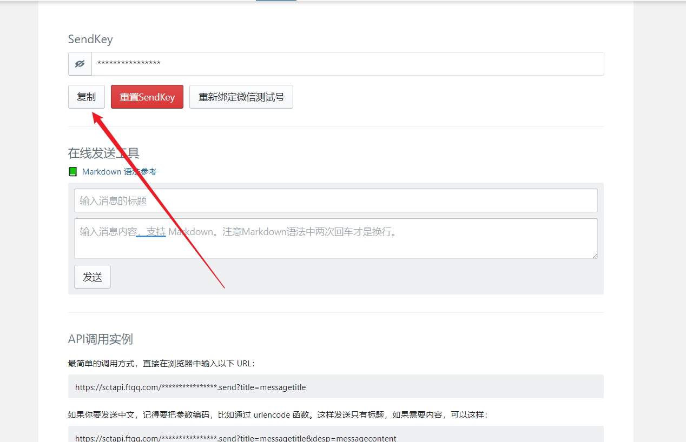
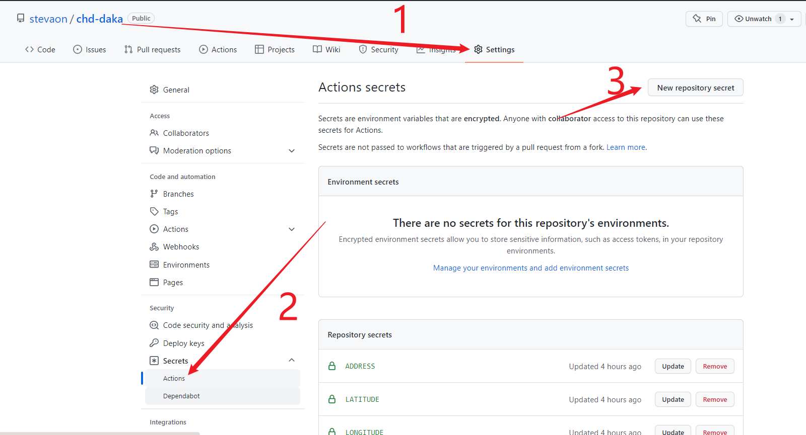
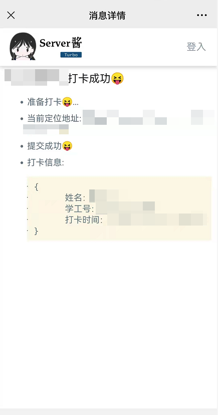

# 长安大学疫情自动打卡脚本

## 免责声明

> 这个脚本只是方便健康的同学打卡的工具，如果你健康状况异常(包括但不限于发烧、干咳、胸闷、乏力、腹泻)的，请及时报告老师，并**立刻停止运行该脚本**。
>
> **你一旦运行这个脚本，即你同意所有内容，请仔细阅读**。由于你没有及时上报真实的健康状况而**导致的所有后果**，由你**本人承担**。
 
## 环境

> python3.9.5
## 版本
- 2022/10/24更新
> 修复打卡超时错误（自测无误），还有问题麻烦贴出方糖的错误代码

- 1.0.3
> 修复登录出错、缺少`packing`包的错误
    >
    > 已`fork`仓库更新百度搜一下就行，也可以按照[这个](https://cloud.tencent.com/developer/article/2100672)更新

- 1.0.2
> 增加`Github Action `自动运行

- 1.0.1
> 修复`ChromeDriver`在`headless`模式下获取定位失败的问题,copy自[chromiumbug反馈](https://bugs.chromium.org/p/chromium/issues/detail?id=834808#c9)

- 1.0.0
> 第一次发布...

## 使用说明

### 方法一: 使用GitHub Actions定时运行

1. Fork本仓库

2. 更改打卡时间
   > 修改`.github\workflows\python-app.xml`中的`corn`配置(**一定要修改，不同账号同一时间很有可能出问题。。。。。暂时无解**),由于github服务器时间是utc时间,国内是东八区,所以`'21 23,2 * * *'`对应的就是国内的上午7点21和10点21。


   > **注意**：设置这个时刻运行并不代表脚本一定会在这个时刻运行，而是服务器会在这个时刻将脚本任务添加到工作队列里面，具体执行时间取决于队列中各任务的排队情况，一般在1个半小时内运行都算正常。

3. 获取Server酱的`SendKey`

   > - 访问[Server酱官网](https://sct.ftqq.com/), 使用微信扫码登陆
   >
   > 
   >
   > - 登陆成功后点击`SendKey`页面,复制你的`SendKey`
   >
   >   
   >   

4. 添加信息

   > `username`: 学号
   >
   > `password`:信息门户密码
   >
   > `address`:当前详细地址
   >
   > `wxkey`:Server酱的`key`
   >
   > 
   >
   > `latitude`:当前纬度(格式44.43323)
   >
   > `longitude`:当前经度(格式154.43332)
   >
   > 
   >
   > 注: 经纬度自行百度获取,如果定位地址与你当前地址不符产生的一切后果**自行承担**......
   >
   > 按照图中步骤添加以上`Secrets`
   >
   > 

5. 启用Actions

6.  打卡结果会推送到自己的微信（需要关注`方糖`服务号）上
    > 注:果果用户可以使用`PushDeer`通道,更方便喔,具体使用方法查看官方教程即可
    
    
    

   

### 方法二:使用自己(办公室)的服务器,配置`config.json`文件就行

- 修改`config.json`中的信息

- 此版本是邮件推送， 需要微信推送的自行修改就是了

  ```json
  {
      "mailInfo": {
          "host_server": "smtp.qq.com",
          "sender_qq": "QQ号",
          "pwd": "QQ邮箱授权码",
          "sender_qq_mail": "xxxxx@qq.com"
      },
      "userInfo": [
          {
              "id": "学号",
              "pw": "密码",
              "wxkey": "",
              "email": "邮箱"
          },
          {
              "id": "学号",
              "pw": "密码",
              "wxkey": "",
              "email": "邮箱"
          },
          {
              "id": "学号",
              "pw": "密码",
              "wxkey": "",
              "email": "邮箱"
          }
      ],
      "address": [
          "宿舍",
          "XXXX",
          "学校",
          "校内"
      ]
  }
  ```

- 运行`main.py`,程序会在每天早上7点和中午13点定时执行,并将打卡结果发送到邮箱

## 参考

部分代码参考自 [这位同学](https://gitee.com/git-lee/chd_DAKA/tree/master ), 感谢!!

